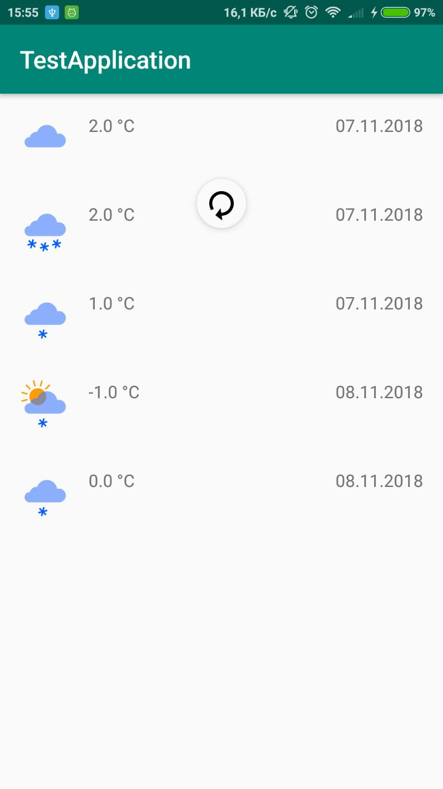

# Тестовый проект
## Описание
Тестовый проект для обучения Android разработке
Выводит прогноз погоды из [API Yandex](https://tech.yandex.ru/weather/doc/dg/concepts/forecast-response-test-docpage/)
## Скрины текущей реализации



## Запуск проекта


 - синхронизация проекта
 - компиляция проекта
 - запуск проекта на устройстве

## Возможные проблемы


## Структура проекта


## Задачи
1.	Выгрузить прогноз вместо 2 дней на 7
```kotlin
const val LIMIT = 2 //Переменная обозначающая количество дней
```
2.	Закрасить элемент в зависимости от времени суток (день и ночь)
```kotlin
item.day - проверка день/ночь
```
```kotlin
itemView.setBackgroundColor(itemView.resources.getColor(R.color.colorBackgroundWeatherDay))//Способ задания фонового цвета
```
```xml
 <color name="colorBackgroundWeatherDay"> -- Цвет дня
 <color name="colorBackgroundWeatherNight"> -- Цвет ночи
```
3.	Для текущей погоды изменить время на "Сегодня ЧЧ:MM"
```kotlin
it.isCurrent // проверка на текущую погоду
```
```kotlin
SimpleDateFormat("HH:mm") // формат времени для отображения ЧЧ:MM
```
4.	Вывести скорость ветра
```kotlin
@SerializedName("wind_speed")
val windSpeed: Float //Скорость ветра
```
Необходимо добавить новое поле TextView в макет item_weather.xml